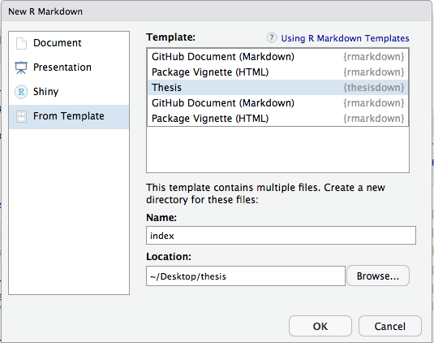

```{r setup, include=FALSE}
knitr::opts_chunk$set(echo = TRUE)
```

## Introduction

[`thesisdown`](https://github.com/ismayc/thesisdown) is the R Markdown template for Reed College's senior thesis. It's a specific use case of [`bookdown`](https://bookdown.org/yihui/bookdown/), a more general format for "authoring books and technical documents with R Markdown". Included in `thesisdown` are templates that help you stay within Reed's [thesis formatting guidelines](http://libguides.reed.edu/c.php?g=338444&p=2278315).

I didn't cite it super well (yet), but a lot of these examples and tips are filtered down from the [`bookdown`](https://bookdown.org/yihui/bookdown/) documentation, particularly places where I was trying to display source LaTeX code (turns out that's hard to do).

## Computing things to know

`thesisdown` rests on a lot of different software packages and document formats. Knowing everything under the hood isn't necessary, but a general understanding of where different steps are evaluated can help troubleshoot problems you're having while using the template.

- [R](https://www.r-project.org/about.html), a programming language for statistical computing.

- [RStudio](https://www.rstudio.com/products/rstudio/), an [IDE](https://en.wikipedia.org/wiki/Integrated_development_environment) for working with R (technically optional, but extremely common).

- [LaTeX](https://www.latex-project.org/about/), a typesetting system that gives you lots of control over text formatting, document guidelines, and citations. LaTeX follows a source-output style, where the plain-text source file (`file.tex`) is compiled into a correctly formatted output file (`file.pdf`).

- [Markdown](https://www.markdownguide.org/getting-started), a way to add formatting to plain text documents that's less complicated than LaTeX (but has less functionality).

- [Pandoc](https://pandoc.org/), a converter that (among other things) takes Markdown documents and converts them into PDFs with LaTeX formatting.

- [R Markdown](https://bookdown.org/yihui/rmarkdown/), an R document format that mixes R code, text with Markdown formatting, LaTeX text and math snippets, and document metadata ([YAML](https://yaml.org/spec/1.2/spec.html#Introduction) header). Like LaTeX, R Markdown follows the paradigm of using a source file (`file.Rmd`) and an output file (`file.pdf`, `file.html`, `file.docx`, etc.).

- [`knitr`](https://yihui.name/knitr/), an R package that helps convert R Markdown files into plain Markdown, so pandoc can convert this Markdown into a specified output file format.

- [`bookdown`](https://bookdown.org/yihui/bookdown/), an R package for authoring multi-document sequences (e.g. books, theses, course notes) with R Markdown. It covers issues Markdown doesn't handle, such as automatic table numbering, table cross-referencing, and figure alignment.

In general, when kntting to PDF, the steps are as follows:

1. `knitr` runs the R code and converts the R Markdown file into a plain Markdown file (`file.md`).

2. Pandoc converts the Markdown file into a TeX source file (`file.tex`).

3. Pandoc calls the LaTeX engine to convert the source file into a pdf (`file.pdf`).

## Setup

1. Prerequisites: install [R, RStudio](https://www.reed.edu/data-at-reed/resources/R/installr.html), and LaTeX ([Windows](https://miktex.org/download) | [Mac](http://tug.org/mactex/mactex-download.html)).

2. Open RStudio and install the `thesisdown` package.

```{r eval = FALSE}
if (!require("remotes")) install.packages("remotes")
if (!require("bookdown")) install.packages("bookdown")

remotes::install_github("ismayc/thesisdown")
```

3. Restart RStudio, create a new R Markdown document, and select the thesis format (*File / New File / R Markdown / From Template / Thesis*, on Mac). **Be sure to name the directory `index`**, or else it won't knit properly. Click *OK* to create the document.

    

You can also create this from the R Console with the following code, exchanging the file path for wherever you want the thesis to live.

```{r eval = FALSE}
rmarkdown::draft(file = "~/Desktop/thesis/index",
                 template = "Thesis",
                 package = "thesisdown",
                 create_dir = TRUE,
                 edit = FALSE)
```

Again, **be sure to name the final folder `index`** to knit properly. The folder immediately above `index` must already exist in order for this to run without errors.

## File structure

The blank thesis template now lives inside of the `index` directory in your chosen file location, and contains the following files and folders:

- [`00--prelim.Rmd`](index/00--prelim.Rmd). Acknowledgements, preface, and dedication. Optional.

- [`00-abstract.Rmd`](index/00-abstract.Rmd). Abstract.

- [`01-chap1.Rmd`](index/01-chap1.Rmd). Chapter 1.

- [`02-chap2.Rmd`](index/02-chap2.Rmd). Chapter 2.

- [`03-chap3.Rmd`](index/03-chap3.Rmd). Chapter 3.

- [`04-conclusion.Rmd`](index/04-conclusion.Rmd). Conclusion.

- [`05-appendix.Rmd`](index/05-appendix.Rmd). Appendix.

- [`99-references.Rmd`](index/99-references.Rmd). Reference formatting, actual bibliography is generated from `bib` upon knit.

- [`_bookdown.yml`](index/_bookdown.yml). A YAML file to define how the multiple Rmd files are combined.

- [`bib`](index/bib). Contains a BibTeX file for citations. Replace with your own.

- [`chemarr.sty`](index/chemarr.sty). LaTeX macro creating some extra-long hooked arrows for chemistry reactions. Optional.

- [`csl`](index/csl). Contains a CSL file to define the APA format of citations. You can download CSLs for other citation formats [here](https://www.zotero.org/styles) to replace this one.

- [`data`](index/data). Folder for data. Optional.

- [`figure`](index/figure). Folder for images. Optional.

- [`index.Rmd`](index/index.Rmd). This is the "master" R Markdown file. Defines the front of the thesis: name, advisor, major, etc. Also includes the introduction.

- [`reedthesis.cls`](index/reedthesis.cls). Creates the thesis document class for LaTeX (do not edit).

- [`template.tex`](index/template.tex). LaTeX thesis template (do not edit).

You can write directly into the `index.Rmd` and numbered files. To create the actual thesis, pick which output you want in the `index.Rmd` YAML by commenting (#) out the lines for `output` that you don't want, then knitting (this defaults to GitBook, so you need to set it to PDF). After knitting for the first time, the following folders appear:

- `_book`. This contains the generated documents for the thesis: the PDF thesis, and the TeX file that generated the PDF (among other things).

- `_bookdown_files`. Contains caches and images created in the thesis document (plots, etc.).

The actual generated thesis lives at:

- [`_book/thesis.pdf`](index/_book/thesis.pdf) (PDF)

- [`_book/index.html`](index/_book/index.html) (GitBook)

- [`_book/thesis.docx`](index/_book/thesis.docx) (Word)

- [`_book/thesis.epub`](index/_book/thesis.epub) (EPUB)

Note that ONLY the PDF file actually complies to the thesis formatting requirements. The others are just extras.

R also creates some intermediate files in the knitting process, which are deleted when the knit completes. If this breaks along the way, this is where you can troubleshoot:

- `thesis.Rmd`. When the R code breaks and throws an R error, it will reference which line the error is on (or rather, which line the chunk containing the error starts on). The line number it cites is in relation to this file, which is the combination of the multiple chapter files that actually knits to directly become the thesis pdf.

- `thesis.log`. This is the TeX log file, which will detail any errors in the LaTeX formatting after the R code is done running. The bottom of this file usually has any errors, and the line numbers it cites refers to `thesis.tex`.

## Dealing with what's in the files

### `index.Rmd`

- Your introduction gets written directly into this file, under the "Introduction" header.

- Be sure to update the YAML header here! Name, date, division, advisor, department, title, output, acknowledgements, dedication, preface. These all need to be customized for your thesis.

- Double check that the files referenced for `bibliography` and `csl` are correct. If you change the citation format or have a differently named file, this needs to be updated.

- `lot` and `lof` are "list of tables" and "list of figures" respectively; leave these as true to match the thesis formatting requirements.

- To include extra LaTeX packages, uncomment lines 43-44 and change/add packages as needed.

### Adding, subtracting, or renaming chapters

By default, [`_bookdown.yml`](index/_bookdown.yml) handles the [chapter ordering](https://bookdown.org/yihui/bookdown/usage.html). The third line of this file (`rmd_files`) defines which files are combined to create the actual thesis document. You can add a chapter by adding it to the directory and this list, and delete one by removing it from the list. As long as the list matches what you want to have in your thesis and the correct file names, all should be well.

The name of each chapter (printed at the top of the chapter in the final document), with a single pound sign, must be the first non-comment line in the Rmd file, as follows:

`# Literature Review`

### Appendix {#appendix}

If you have code in one of the Rmd files that breaks the visual flow of the thesis but should still be included, the appendix is a good place to display this. For an example of how to do this, look at the `include_packages` chunk in [`index.Rmd`](index/index.Rmd) (starting on line 59). To hide this code, the `include = FALSE` option was set. The output of the chunk, if any is produced, will still be displayed.

The code is displayed using the chunk on line 16 of [`05-appendix.Rmd`](index/05-appendix.Rmd). It uses the name of the original chunk to duplicate it here, then sets `results = 'hide'` to only show the code and hide the output.

### Abstract and prelim

You may notice that two of the included files are [`00-abstract.Rmd`](index/00-abstract.Rmd) and [`00--prelim.Rmd`](index/00--prelim.Rmd) (for acknowledgements, preface, and dedication), but these sections are duplicated in the YAML of `index.Rmd`. This doubling is mostly an artifact of an attempted edit to the template that was never quite finished.

You can add your abstract directly to the `00-abstract.Rmd` file, and line 23 of `index.Rmd` will automatically include it in the document. For acknowledgements, dedication, and preface, yo should write directly into the YAML of `index.Rmd` (I wasn't able to figure out how to add the file like the abstract).

### References

`thesisdown` will automatically insert your bibliography (from a BibTeX file) for you after all of the other writing. The file `99-references.Rmd` thus contains only two main things: a header for the references section, and a list of entried that aren't directly cited in the thesis writing.

This `nocite` section is where you can insert citation keys for sources that aren't directly cited in-line during your thesis, but still need to appear in the bibliography. This is aprticularly useful for R packages used, among other things.

## Formatting

### Basic Markdown

[More on this](https://www.markdownguide.org/cheat-sheet).

- Double asterisk for **bold** (`**bold**`), sigle asterisk for *italic* (`*italic*`).

- Hyperlinks: clickable text in square brackets, immediately followed by the path in parentheses. `[text](link)`.

- Images: same as hyperlinks (alternate text in brackets), but add an exclamation mark immediately before the squarebrackets. ``.

- Headers: with differing numbers of pound signs (`#`). One is a first-level header or title, all the way down to six.

- Ordered lists: lines preceded by `1. `, `2. `, `3. `.

- Unordered lists: lines preceded by `- `.

### LaTeX

R Markdown has some support for direct LaTeX integration. This can be useful for equations, table formatting

- In-line: surround the LaTeX expression with dollar signs (`$`). To separate the LaTeX text 

- Display/equation mode: surround with double dollar signs (`$$`) or surround the text with backslash-escaped brackets: `\[y = 3x + 7\]`.

## Object referencing

NB: All labels in bookdown must only contain alphanumeric characters, :, -, and/or /. You have to add a prefix to the labels for tables (`tab:`), figures (`fig:`) and equations (`eq:`) to get them to number correctly (tables have a separate numbering from figures, etc.).

### In-line code

While the text vs. code distinction is useful for understanding R Markdown, there are ways of further mixing the two. Say you report the mean of a sample with some code, then discuss it with the sentence "The mean age of our sample was 43.5". If your sample changes, however, "hard-coding" this number in with plain text won't update the number accordingly. Instead, you can add some R code to automatically update the number:

````markdown
The mean age of our sample was `r '\x60r mean(sample$age)\x60'`.
````

This line in the Rmd file, when knitted, will replace the code with the output of the evaluated code: `mean(sample$age)`.

### Footnotes

To add a footnote, add a caret after the text (where the footnote number should appear) and then immediately include the footnote in brackets: `^[Extra info about that sentence.]`. Or, if you want to keep a sense of flow in your source document, add a reference label to call back to it`[^another_note]` and then add the note below:

`[^another_note]: Some more info about that other sentence.`

The footnotes will automatically be numbered sequentially, so just make sure that each one has a unique label (or appears in place).

### Tables and figures

Tables and figures that are generated in R chunks can be referenced using the chunk name they wre created in. If you make a graph in a chunk named "graph-1", then refer back to it later with `\@ref(fig:chunk-1)`. The `\@ref(label)` is a general syntax for linking back to things, and `fig:` is a prefix that indicates you are referencing the figure created by the code chunk, not the code chunk itself. For a table generated by a chunk, the prefix used is `tab:`.

For figures and tables not generated by chunks, the format is different. For a table written directly in Markdown, to appear in the list of tables you'll have to give it a caption like `Table: Caption words`. To add a label to this, we give it a modified anchor:

`Table: (\#tab:caption-words) Caption words`.

You can then call the table with the same reference as normal: `\@ref(tab:caption-words)`.

### Equations

To number and reference equations, you can use LaTeX's equation environment. By adding the following reference `(\#eq:binom)` to the end of the equation, it will be given a number (as in LaTeX, use the `equation*` environment to have unnumbered equations) and internal reference. You can then refer to it later in the text by typing `Equation \@ref(eq:binom)`.

```latex
\begin{equation} 
  f\left(k\right) = \binom{n}{k} p^k\left(1-p\right)^{n-k}
  (\#eq:binom)
\end{equation} 
```

### Sections

You can add an anchor to section headers to link back to them. The format for this is `## Introduction {#intro}`, where "Introduction" will be printed as the header and "intro" is the anchor to refer to this section. Then, when you want to refer back to the section: `See the [introduction](#intro)`.

Some [rules](https://stackoverflow.com/a/47819283) for anchors:

- Only use one `#`, even if the header has multiple.

- Anchor text must immediately follow the `#`, no spaces.

- No spaces in the anchor text; separate with dashes (better than underscores, for LaTeX reasons).

- No uppercase characters.

### Chunks

R chunks can be given labels as well! In the opening line of the chunk, just add a name (here, "label") after `r`:

`` ```{r label, echo = FALSE} ``.

To copy the chunk later, see the format used in the [appendix](#appendix).

### Citations

This section covers using BibTeX to format your citations. A BibTeX file contains a series of entries similar to the following, one for each work needed for your bibliography:

```
@Manual{rcv-package,
  title = {rcv: Ranked Choice Voting},
  author = {Jay Lee and Matthew Yancheff},
  year = {2019},
  note = {R package version 0.2.2},
  url = {https://github.com/ds-elections/rcv},
}
```

The first field inside the brackets is the citation key (`rcv-package`), which is how you refer to this entry from the document. To cite an entry, insert `@key` or `[@key]` into your writing. The CSL format that you use will define how both the in-line citations and the full references appear.

[More on this](https://bookdown.org/yihui/bookdown/citations.html).

## Extra fun tidbits

### File path issues

R Markdown has some non-intuitive behaviors when it comes to relative file names. A typical structure in R repositories is the Project (big P), which is meant to be a self-contained folder containing everything needed for a project (small p) you're working on. The working directory is generally set to the root of the Project, so relative file names are indexed to this location. When you knit an R Markdown document, however, it temporarily sets the parent directory of the Rmd file to be the working directory. This can mess up any relative file paths which ran fine in lin-by-line code tests (indexed to the Project), but are now breaking your knit (indexed to the Rmd file).

For example, maybe your `index` directory lives inside of an R Project foldered as `thesis`, with your data inside the subfolder `data`. When running code in the console, your data can be accessed through `data/file.csv`. When running it in the thesis Rmd file (inside `index`), however, R (correctly) recognizes that there is nothing at `index/data/file.csv` and will fail to read the file. You would then have to change your Rmd script to the file path `../data.file/csv`, but you then lose the ability to run it in the console.

Possible fixes:

- The `here` package, which standardizes relative file locations. After loading it once for the project (`library(here)`), using the command `here('data', 'file.csv')` (from the Project directory) in place of any call to `file.csv` will automatically use the correct relative path based on the current working directory. This is the best way to maintain reproducibility and portability in your analyses. It also abstracts this file reference problem away so you don't have to think about it!

- Place everything inside `index`. This is an option, but it can be useful to have thesis-related things outside of the `index` structure: data, Zotero libraries, etc.

- Use `setwd()` at the top of your Rmd file. This is bad because you can lose the ability to call things directly from the console, and any change in directory setup (new computer, RStudio server, etc.) will require a change - which is not a good reproducible practice.

- Use full absolute file paths all the time. Bad because of the same directory change as above (also gets tedious).

### YAML formatting

YAML ("Yet Another Markup Language", or "YAML Ain't Markup Language") is a protocol for defining the metadata for a document: title, author, output format, whether there should be a table of contents, etc. The indentation for this needs to be followed exactly, or else it'll read some values as `NULL` that should not be. For example, in the following:

```
output: 
  thesisdown::thesis_pdf: default
```

The indentation on the second line indicates that it's a sub-option of the first line. If you remove this indentation, it will read them as two separate options: `output`, with the value `NULL`, and `thesisdown::thesis_pdf`, with the value `default`.

### Why does it have to be named `index`?

One of the formats you can knit your thesis to is GitBook, which is built on top of some HTML. This format is a webpage, so the "home" of the page needs to be called `index`. If you're only knitting to pdf, you can maybe change this, but it's best to leave it as is just in case...

### Underscore issues

A problem: R people really like underscores to separate words in object names (dots represent something else), but LaTeX doesn't like underscores (they're a special character, so displaying them verbatim is tricky sometimes). It's hard to anticipate every case where this is an issue, but the [`xtable` package](https://cran.r-project.org/web/packages/xtable/vignettes/xtableGallery.pdf) is a good option for displaying a table that has underscores in column names or data.

One other issue is with code chunk names containing underscores. To reference a table in the text, [you can reference it](https://bookdown.org/yihui/bookdown/tables.html) with the name of the chunk that created it. If the chunk name has an underscore, however, the LaTeX reference created will break because of this. So avoid naming chunks with underscores if you're referencing tables this way.

### Pound signs

Note that the pound sign (#) does multiple things in the document. In a code chunk or the YAML header, the pound sign will comment out a line so it is not evaluated. In a plain-text section, the pound sign denotes a line as a Markdown header.

### Why does my file take so long to knit?

The short answer is that your actual code probably takes a while to run. You can try to save time in a few ways, however.

- Add `cache = TRUE` as an argument to chunks that are taking a long time to run; this will run code and save the results the first time, and quickly call on the saved results in the future. Watch out for issues here if your source data/objects change in some way.

- Rather than knitting the entire book, you can knit just one chapter with the `bookdown::preview_chapter` function.

- If you're doing some heavy analysis that won't change over the course of writing your thesis, you can move this out into a series of R scripts that save their output, then call the output alone in the thesis files. This is also a good option for plots that take a long time to render.

### Other questions?

Check out the [`bookdown`](https://bookdown.org/yihui/bookdown/) documentation for further info. It has more on why certain things are the way that they are, additional LaTeX customization (theorems, special headers, further references), and troubleshooting.

## Useful links

- [Reed thesis help](https://www.reed.edu/cis/help/thesis/index.html#template).

- [Reed R help](https://www.reed.edu/data-at-reed/resources/R/index.html).

- [`thesisdown` GitHub repository](https://github.com/ismayc/thesisdown).

- [`bookdown` documentation](https://bookdown.org/yihui/bookdown/).

- ['huskydown' package](https://github.com/benmarwick/huskydown), similar to thesisdown but with more user guidance.

- [`citr` RStudio add-in](https://github.com/crsh/citr), for automating some of the Markdown citation process.

- [Blog posts](https://rosannavanhespenresearch.wordpress.com/2016/02/03/writing-your-thesis-with-r-markdown-1-getting-started/) on writing a [thesis](https://eddjberry.netlify.com/post/writing-your-thesis-with-bookdown/) with R Markdown.

- [Chester](https://github.com/ismayc)'s old [slides](http://www.rpubs.com/cismay/twatchers_2k16_rmd).
